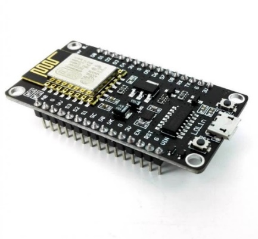
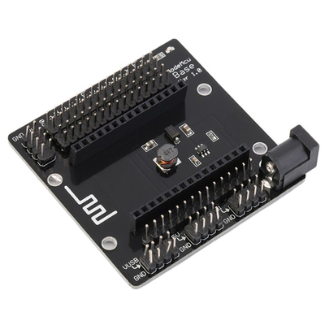
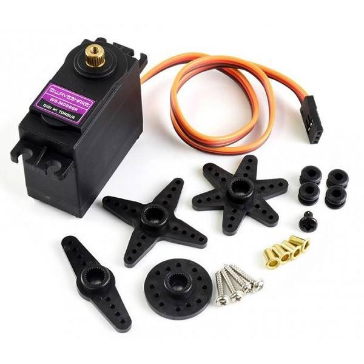
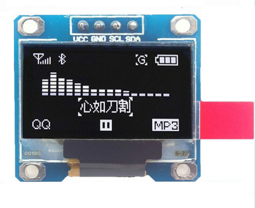
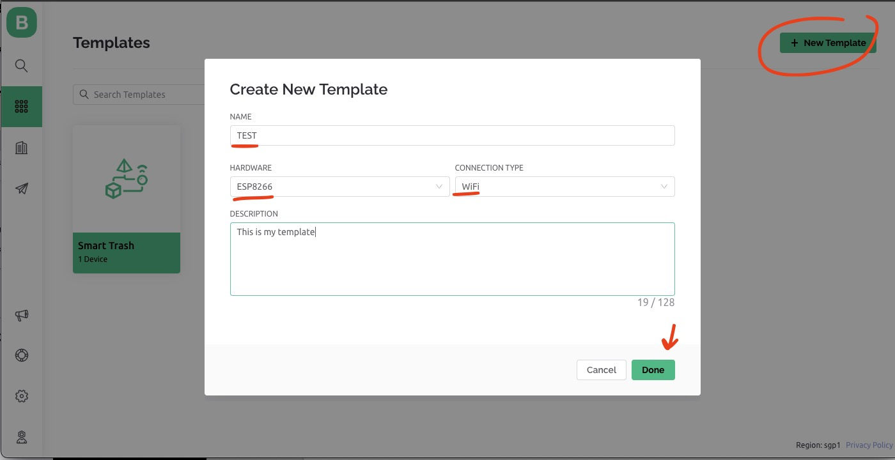
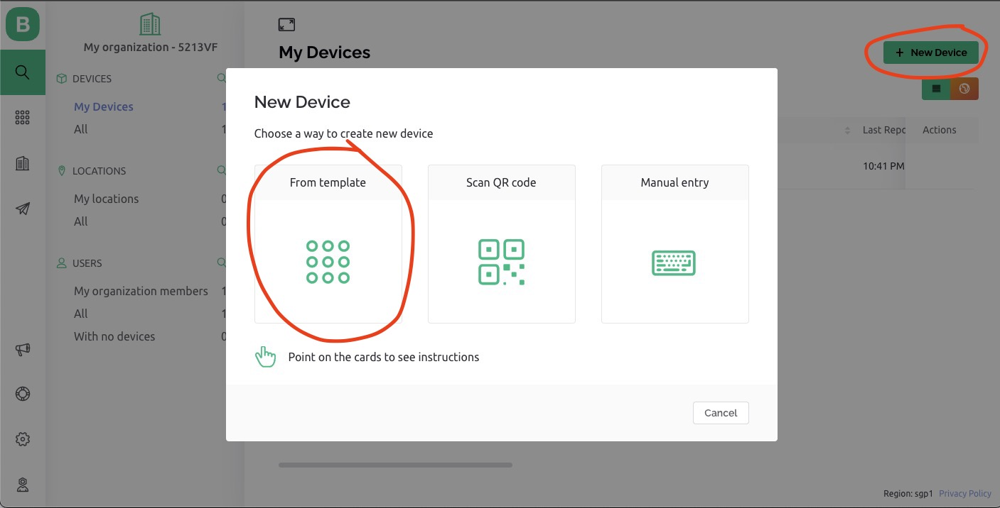
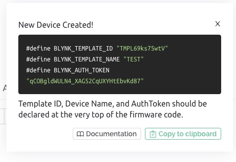
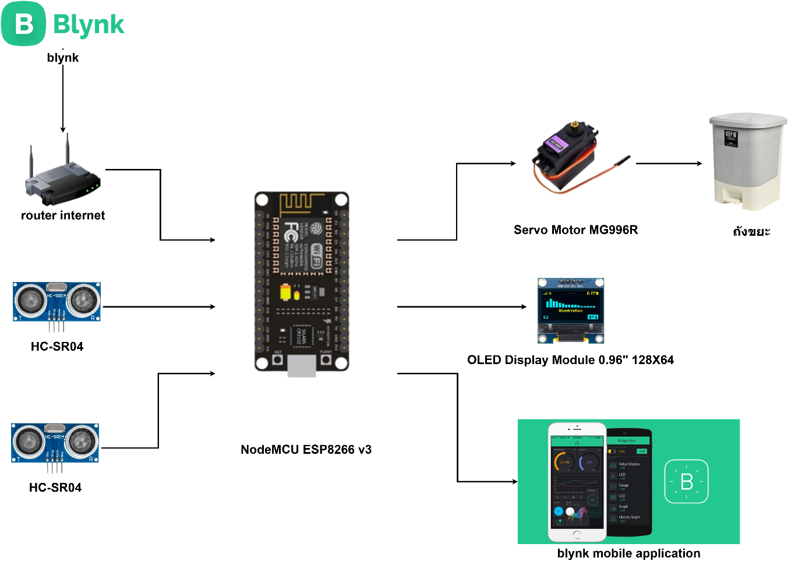
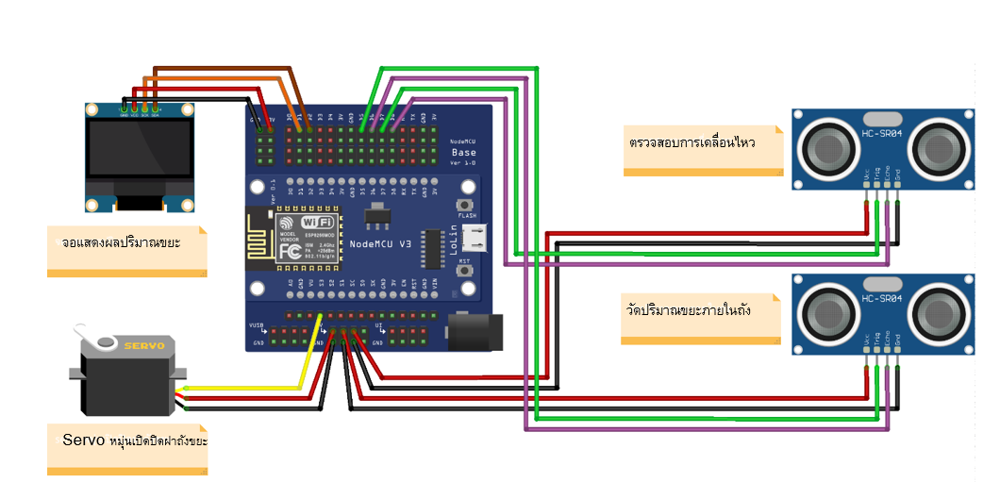
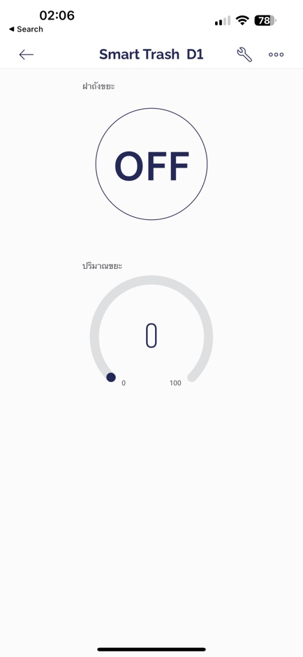

# smart-trash

**วิธีดำเนินการวิจัย (RESEARCH METHODS)**

- อุปกรณ์และเซนเซอร์

1. NodeMCU V3 ESP8266

2. NodeMCU Base

3. HC-SR04 Ultrasonic Sensor Module

4. Servo Motor MG996R

5. 0.96 inch I2C OLED 128X64 Display Module

6. powerbank

7. ลังกระดาษ

8. สาย jumper

NodeMCU V3 ESP8266

บอร์ดพัฒนาเพื่อใช้ในการพัฒนาโปรแกรมและเชื่อมต่อกับอินเทอร์เน็ตไร้สาย (WiFi) โดยใช้ชิป
ESP8266 ซึ่งเป็นชิปคอมพิวเตอร์เบื้องต้นที่มีความสามารถในการเชื่อมต่อ WiFi
และประมวลผลข้อมูลแบบไม่มีหน่วยความจำหรือไม่มีเครื่องมือทางฮาร์ดแวร์เพิ่มเติมบอร์ด NodeMCU
V3 ESP8266 มีขนาดเล็กและมีขาต่อต่างๆ ที่สามารถใช้งานได้หลากหลาย เช่น ขา USB
สำหรับเชื่อมต่อกับคอมพิวเตอร์ เพื่ออัพโหลดโปรแกรม



NodeMCU Base

เป็นอุปกรณ์ตัวช่วยในการใช้งาน NodeMCU V3 ESP8266
โดยมีหน้าที่เสริมสร้างความสะดวกในการเชื่อมต่อกับอุปกรณ์อื่น ๆ และส่วนต่าง ๆ
ของระบบประกอบด้วยพอร์ตต่าง ๆ เช่น USB สำหรับเชื่อมต่อกับคอมพิวเตอร์
เพื่ออัพโหลดโปรแกรมหรือเชื่อมต่อ Serial Monitor เพื่อดูผลลัพธ์ของโปรแกรม มีพอร์ต GPIO
สำหรับเชื่อมต่อกับเซ็นเซอร์หรืออุปกรณ์อื่น ๆ และมีช่องสำหรับเสียบ NodeMCU V3 ESP8266
เพื่อให้สามารถใช้งานร่วมกันได้อย่างสมบูรณ์ นอกจากนี้ NodeMCU Base ยังมีพลังงานในตัว
(on-board power supply) ที่สามารถใช้งานได้ทั้งแบบ AC และ DC
และมีความปลอดภัยด้วยการมีฟิวส์ป้องกันไฟฟ้าชนิดต่าง ๆ



มีขาดังนี้

D0 ต่อกับ signel Servo Motor

D1 ต่อกับ SCL OLED

D2 ต่อกับ SDA OLED

D5 ต่อกับ Trig RX Ultrasonic Sensor ด้านหน้า

D6 ต่อกับ Echo TX Ultrasonic Sensor ด้านหน้า

D7 ต่อกับ Trig RX Ultrasonic Sensor ด้านใน

D8 ต่อกับ Echo TX Ultrasonic Sensor ด้านใน

HC-SR04 Ultrasonic Sensor Module

เป็นโมดูลเซ็นเซอร์อัลตราโซนิค (Ultrasonic Sensor Module) ที่ใช้งานง่ายและมีราคาถูก
โดยมีหน้าที่ในการวัดระยะทางโดยใช้คลื่นเสียงอัลตราโซนิค (Ultrasonic waves)
โดยส่งสัญญาณเสียงออกไปยังวัตถุ แล้วรอรับสัญญาณเสียงที่ถูกส่งกลับมา
เพื่อคำนวณหาระยะทางจากเวลาที่ใช้ในการส่งและรับสัญญาณ
เป็นวิธีการที่ใช้งานได้ดีในการวัดระยะทางระหว่างออปเจคต่าง ๆ

มีขาดังนี้

- VCC: ใช้สำหรับเชื่อมต่อกับแหล่งจ่ายไฟบวก 5V

- Trig: ใช้สำหรับส่งสัญญาณ ultrasonic pulse เพื่อสั่งให้เซนเซอร์ทำการวัดระยะทาง

- Echo: ใช้สำหรับรับสัญญาณ ultrasonic pulse
    ที่ส่งออกมาจากเซนเซอร์เมื่อมีการสะท้อนกลับมาจากวัตถุ

- GND: ใช้สำหรับเชื่อมต่อกับแหล่งจ่ายไฟลบ


Servo Motor MG996R

เป็นเซอร์โวมอเตอร์ (Servo Motor)
ที่มีการออกแบบมาเพื่อใช้งานในงานที่ต้องการการควบคุมการหมุนของมอเตอร์อย่างแม่นยำ
โดยมีการควบคุมแบบไดร์เวอร์เพื่อควบคุมองศาของการหมุน ซึ่งสามารถหมุนได้จาก 0 องศาถึง
180 องศา และสามารถทำการเซ็ตค่าได้ด้วยตัวแปร (Variable)
ที่ใช้ในการควบคุมเครื่องมือหรือชิ้นส่วนต่าง ๆมีขนาดกลมและมีขนาดใหญ่มาก
เหมาะสำหรับงานที่ต้องการแรงบิด (Torque) สูงเพราะมีความทนทานและความแม่นยำสูง
นอกจากนี้ Servo Motor MG996R ยังสามารถทำการปรับตั้งค่าการทำงานต่าง ๆ เช่น
การปรับความเร็วหมุน การตั้งค่าองศาการหมุน และอื่น ๆ ได้ง่ายดาย
สามารถใช้งานร่วมกับบอร์ดพัฒนา เช่น Arduino หรือไมโครคอนโทรลเลอร์อื่น ๆ ได้ง่าย
และมีค่าใช้จ่ายที่ไม่สูงมาก

มีขาดังนี้

- VCC (สีแดง): ใช้สำหรับเชื่อมต่อกับแหล่งจ่ายไฟบวก 4.8-7.2 โวลต์

- GND (สีน้ำตาล): ใช้สำหรับเชื่อมต่อกับแหล่งจ่ายไฟลบ

- Signal (สีเหลือง): ใช้สำหรับเชื่อมต่อกับวงจรควบคุม เพื่อสั่งการทำงานของโมเตอร์



0.96 inch I2C OLED 128X64 Display Module

เป็นโมดูลแสดงผลแบบ OLED ที่มีขนาดหน้าจอขนาด 0.96 นิ้ว และใช้ชิฟเซ็ต SSD1306
เพื่อเชื่อมต่อกับบอร์ดแบบ I2C (Inter-Integrated Circuit)
ซึ่งช่วยให้สามารถสื่อสารได้อย่างรวดเร็วและง่ายดายกับไมโครคอนโทรลเลอร์หรือบอร์ดพัฒนาอื่น
ๆสามารถแสดงผลข้อความและกราฟิกได้อย่างชัดเจนและคมชัด โดยมีความละเอียดหน้าจอ 128x64
พิกเซล และมีความสว่างสูง สามารถแสดงผลได้ในสภาวะแสงน้อย
เหมาะสำหรับการใช้งานในการแสดงผลข้อมูลที่ต้องการแสดงผลแบบเลื่อนหรือข้อมูลที่ต้องการแสดงผลเป็นกราฟิก
สามารถนำมาใช้กับโปรเจคอิเล็กทรอนิกส์ต่าง ๆ เช่น การแสดงผลข้อมูลอุณหภูมิ,
การแสดงสถานะของอุปกรณ์, การแสดงผลเปอร์เซ็นต์ และอื่น ๆ
โดยมีขนาดเล็กและมีความพร้อมใช้งานสูง

เชื่อมต่อ I2C ในการสื่อสารกับไมโครคอนโทรเลอร์หรือบอร์ดควบคุม โดยมีขาเชื่อมต่อดังนี้

- VCC: ใช้สำหรับเชื่อมต่อกับแหล่งจ่ายไฟบวก 3.3V - 5V

- GND: ใช้สำหรับเชื่อมต่อกับแหล่งจ่ายไฟลบ

- SCL: ใช้สำหรับส่งสัญญาณ clock ในการสื่อสารผ่านช่องเชื่อมต่อ I2C

- SDA: ใช้สำหรับส่งข้อมูลผ่านช่องเชื่อมต่อ I2C



Blynk Application

คือ Application สำเร็จรูปมาพร้อมกัน Service บน Cloud สำหรับงาน IOT
มีความน่าสนใจคือการสร้างโครงงานได้ไม่ยาก สามารถใช้งานได้อย่าง Real time
สามารถเชื่อมต่อ Device ต่างๆเข้ากับ Internet ได้อย่างง่ายดาย ไม่ว่าจะเป็น Arduino,
Esp8266, Esp32, Nodemcu หรือ Rasberry Pi นำมาแสดงบน Application
ได้อย่างง่ายดาย แล้วที่สำคัญ Application Blynk ไม่เสียค่าใช้จ่าย และ รองรับในระบบ IOS
และ Android วิธีการทำงานของ Blynk เริ่มจาก อุปกรณ์ เช่น Arduino esp8266 Esp32
Rasberry Pi เชื่อมต่อไปยัง Server ของ Blynk โดยตรง
สามารถรับส่งข้อมูลหากันได้คอมพิวเตอร์ Smartphone ก็จะเชื่อมต่อกับ Server ของ Blynk
โดยตรง ทำหน้าที่เป็น Server
เป็นสะพานให้เชื่อมต่อหากันทำให้อุปกรณ์ของเรามีความฉลาดมากขึ้น


ชั้นตอนการสร้าง Blynk

1. สร้าง Template โดยกดที่ New Template

    1. ใส่ชื่อ Template

    2. เลือก Hardware เป็น ESP8266

    3. เลือก Connection type เป็น WIFI

    4. กด Done



2. เพิ่ม Device โดยกดที่ New Device

```{=html}
<!-- -->
```

1. เลือก Template ที่ให้ Device ใช้

2. ตั้งชื่อ Device

3. กด Create

4. ก Template ID, Device Name,
    AuthToken ไปใส่ใน Code ของโปรเจค



3. ตั้งค่าหน้าควบคุม Blynk Application

    1. เลือก Device ที่ต้องการตั้งค่าหน้าควบคุม


2. แก้ไข หน้าควบคุมกดที่ปุ่ม ประแจ


3. เพิ่ม ควบคุมกดที่ปุ่ม +

> 
>
> 4\. เพิ่ม widget ตามที่ต้องการ


**ผลการวิจัย (RESULTS)**

- การทำงานของระบบ

ขั้นตอนการทำงานของระบบ

- Powerbank สำหรับให้พลังงานวงจรทั้งหมด

- Ultrasonic Sensor นอกถังขยะ ตรวจจับการเคลื่อนไหว

- ถ้ามีการเคลื่อนไหวสั่ง Servo Motor เปิดฝาถังขยะ

- Ultrasonic Sensor ในถังขยะตรวจสอบปริมาณขยะในถังขยะ

- OLED จอแสดงผลปริมาณขยะและแสดงผลถังขยะเต็มหรือไม่

- NodeMCU V3 ESP8266 ทำการเชื่อมต่อ wifi และเชื่อมต่อไปยัง Blynk เพื่อควบคุม
    เปิด/ปิด ถังขยะ แสดงผลปริมาณขยะ และแสดงผลถังขยะเต็มหรือไม่ผ่าน Application
    Blynk ใน Mobile Device

```{=html}
<!-- -->
```

- สถาปัตยกรรมของโครงงาน



- การออกแบบวงจร



Flowchart หรือ สถาปัตยกรรม


- รูปภาพโครงงาน

ถังชยะปิด เมื่อไม่มีวัตถุผ่าน Ultrasonic Sensor


ถังชยะเปิด เมื่อมีวัตถุผ่าน Ultrasonic Sensor


เมื่อมีขยะในถังขยะ จะแสดงปริมาณขยะบนจอ OLED


สามารถเปิดฝาถังขยะ และ ตรวจสอบ ปริมาณขยะได้ ผ่าน blynk application

cal user interface, application
Description automatically
generated](assets/media/image22.png)er interface, application
Description automatically
generated](assets/media/image23.png)

**สรุป**

การวิจัยถังขยะอัจฉริยะช่วยให้การจัดการขยะเป็นไปอย่างมีประสิทธิภาพมากยิ่งขึ้น
โดยใช้ลังกระดาษเป็นตัวถังขยะ ซึ่งมีอุปกรณ์เซนเซอร์ตรวจจับระดับขยะภายในถัง และมีโมดูล
NodeMCU ESP8266 ใช้ส่งข้อมูลเซ็นเซอร์ไปยังแพลตฟอร์ม Blynk ผ่าน Wi-Fi
ที่เชื่อมต่อกับอุปกรณ์มือถือ ผู้ใช้สามารถเปิดปิด และตรวจสอบระดับของขยะที่ต้องการในแอปพลิเคชัน
Blynk และเมื่อถังขยะเต็มจนถึงระดับที่ตั้งไว้ แอปพลิเคชันจะแจ้งเตือนผู้ใช้ว่าถังขยะเต็มแล้ว
ทำให้ผู้ใช้สามารถรวบรวมขยะได้อย่างมีประสิทธิภาพอย่างรวดเร็วและสะดวกสบาย
งานวิจัยนี้เป็นตัวอย่างของการนำเทคโนโลยีและนวัตกรรมมาใช้เพื่อแก้ปัญหาสิ่งแวดล้อม
และการทำงานนี้สามารถนำไปใช้ประโยชน์ได้จริงสำหรับคนที่ต้องการจัดการขยะอย่างมีประสิทธิภาพ

**อ้างอิง**

Arduitronics\"HC-SR04P Ultrasonic Sensor Module\"(2562).\[Oline\]:
<https://shorturl.asia/wnE64>

Arduitronics\"NodeMCU
Base\"(2562).\[Oline\]:<https://www.arduitronics.com/product/1133/nodemcu-base-for-nodemcu-v3>

CyberTice,"0.96 inch I2C OLED 128X64 Display Module"(2557).\[Oline\]:
<https://shorturl.asia/w8H4Q>

CyberTice,"NodeMCU ESP8266 v3"(2557).\[Oline\]:
<https://shorturl.asia/QSRw4>

ThaiEasyElec\"Servo Motor
MG996R\"(2023)).\[Oline\]://www.thaieasyelec.com/product/627/mg996r-servo-metal-gear-high-torque\\

นายชนินทร์ เอี่ยมสอาด,นายธีรภัทร
ประวัติรุ่งเรือง(2555).การพัฒนาระบบควบคุมไฟฟ้าอัตโนมัติในห้องน้ำ.สาขาวิชาเทคโนโลยีสารสนเทศ
คณะเทคโนโลยีสารสนเทศ
มหาวิทยาลัยนอร์ทกรุงเทพ:<https://www.northbkk.ac.th/research\_/themes/downloads/abstract/1519633122_abstract.pdf>

นรจ.จิรกิตติ์ คงเมืองกุลศรี, นรจ.พงศธร ต่ายธานี, นรจ.สุรนาท สองนาม, นรจ.อาชา
ศรีโสภา, นรจ.ขันติ เผ่าภูรี(2560).ถังขยะเปิด-ปิดอัตโนมัติด้วยระบบเซ็นเซอร์:
<https://elecschool.navy.mi.th/pro/doc60/13%E0%B8%96%E0%B8%B1%E0%B8%87%E0%B8%82%E0%B8%A2%E0%B8%B0%E0%B9%80%E0%B8%9B%E0%B8%B4%E0%B8%94-%E0%B8%9B%E0%B8%B4%E0%B8%94%E0%B8%AD%E0%B8%B1%E0%B8%95%E0%B9%82%E0%B8%99%E0%B8%A1%E0%B8%B1%E0%B8%95%E0%B8%B4%E0%B8%94%E0%B9%89%E0%B8%A7%E0%B8%A2%E0%B8%A3%E0%B8%B0%E0%B8%9A%E0%B8%9A%E0%B9%80%E0%B8%8B%E0%B9%87%E0%B8%99%E0%B9%80%E0%B8%8B%E0%B8%AD%E0%B8%A3%E0%B9%8C.pdf>

รัตนนิมิตร ว., เกษพานิชว., & ชุนประวัติ ส. (2019). INSTALLATION OF SMART FARM
SERVER FOR DATA MONITORING VIA MOBILE APPLICATION. Journal of Energy and
Environment Technology of Graduate School Siam Technology College, 6(1),
37--42. Retrieved from
<https://ph01.tci-thaijo.org/index.php/JEET/article/view/197574>

นายจันตพงษ์
บุตรลักษณ์(2560).การพัฒนาระบบเฝ้าระวังสภาพแวดล้อมของเซิร์ฟเวอร์แร็ค:<https://icit.kmutnb.ac.th/main/wp-content/uploads/2021/02/research_icit_development_of_rack_server_security.pdf>

นางสาวกนกวรรณ ศรีวงศ์สุข, นางสาวราวรจิรณ ภ่ผูึง, นางสาวสุมิตตา
นกสกุล(2562).ถังขยะอัจฉริยะ AUTO BIN: <https://shorturl.asia/CVMeA>
